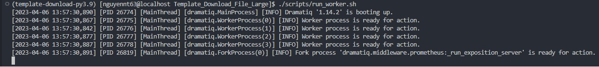
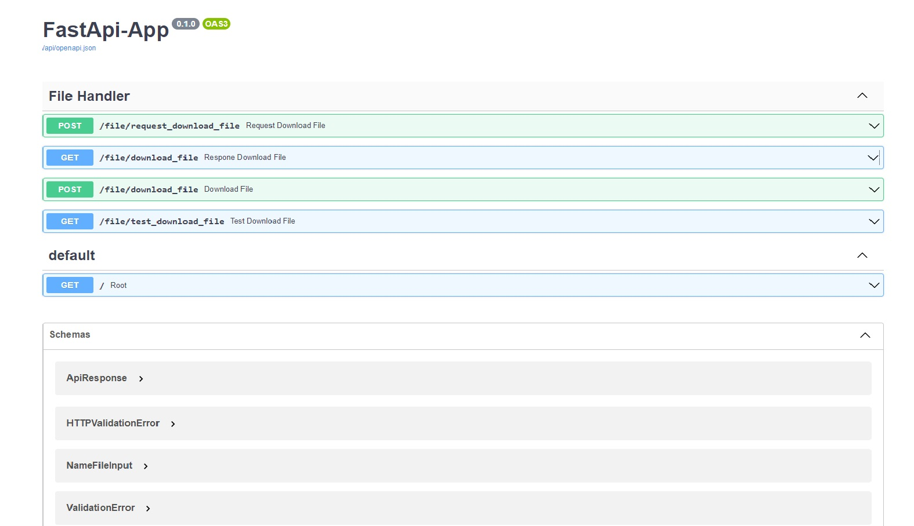
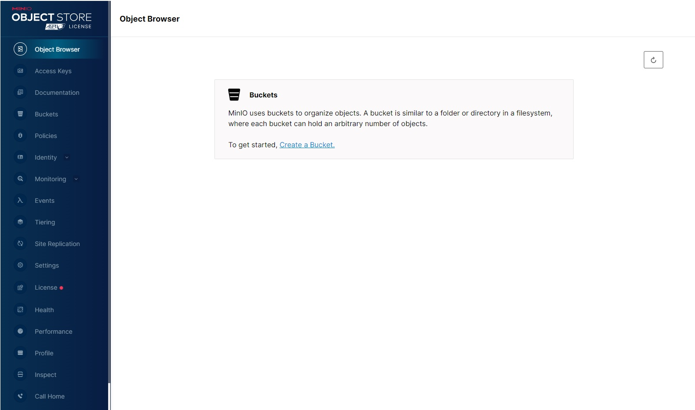

# A. INTRODUCE PROJECT

### This is Template using dowload and upload a large file ( Goot at ~ 500mb, Type suport : excel, images, video, mp3 )
- Result : 
         - Process and upload file excel about 1M records ~ 400s
         - Process and upload file excel about 500k records ~ 20s
         - Process and upload file excel about 50k records ~ 20s
         - Download file 1M records or 500k records from Minio ~ 0.5s

##### Technology :

- Python 3.9 ( Using poetry to manage library )
- FastAPI - Main Framework
- MongoDB - Database
- Minio - Storage Server
- Dramatiq - Worker
- RabbitMQ - Message Broker

# B. SET UP:

### STEP 1 : Set up enviroments

#### 1/ Database MongoDB :

```
https://www.mongodb.com/docs/manual/tutorial/install-mongodb-on-ubuntu/
```

#### 2/ Minio :

```
sudo docker run -d -p 9000:9000 -p 9001:9001 -e "MINIO_ROOT_USER=minio_scc" -e "MINIO_ROOT_PASSWORD=minio_scc"  quay.io/minio/minio server /data --console-address ":9001"
```

#### 3/ RabbitMQ

```
version: '3'

services:
  rabbitmq:
    image: rabbitmq:3.9.7-management-alpine
    ports:
      - "5672:5672"
      - "15672:15672"
    environment:
      RABBITMQ_DEFAULT_USER: admin
      RABBITMQ_DEFAULT_PASS: admin
      RABBITMQ_DEFAULT_VHOST: nguyennt63
    volumes:
      - ./rabbitmq_data:/var/lib/rabbitmq
      - ./rabbitmq_scripts:/opt/rabbitmq_scripts
    command: >
      sh -c "rabbitmq-server start && rabbitmqctl add_user user password &&
             rabbitmqctl set_user_tags user administrator &&
             rabbitmqctl set_permissions -p my_vhost user '.*' '.*' '.*' &&
             rabbitmqctl stop && tail -f /dev/null"
```

#### 4/ Poetry

```
  curl -sSL https://install.python-poetry.org | python3.10 -
```

### STEP 2 : INITIALIZE PROJECT

#### Do this one time when clone source

- Config poetry to create env and install requirement

  ```
  $ chmod +x ./scripts/*.sh
  $ ./scripts/initialize_project.sh
  ```
- Install new library

  ```
  $ poetry add "some_library"
  ```

### STEP 3 : RUN PROJECT

- Activate venv poetry :

```
    $ source .venv/bin/activate
```

- Run App

```
    $ ./scripts/run_app.sh
```

- Run Dramatiq Worker

```
    $ ./scripts/run_worker.sh
```



# C. ACCESS WEB MANAGEMANT

- **Swagger UI FastAPI**

  ```
   - http://localhost:3001/docs
  ```

  
- **RabbitMQ Managemant**

  - *Queues of dramatiq (defaut : default, defualt.DQ, defualt.XQ) but in this template queues of dramatiq are file_handler, file_handler.DQ, file_handler.XQ*

  ```
   - http://localhost:15672/vituralhost
  ```

  

- **Minio Object Store**

  ```
   - http://localhost:9001/browser
  ```
  
